<!-- omit in toc -->
User Manual
<!-- omit in toc -->
Meta Parameter Optimizer

---

# Quickstart
This quickstart tutorial is aimed at people who have already worked with the Meta Parameter Optimizer and need to refresh their memory on the exact order of things. If you are a first time user, please read the rest of the documentation, starting from the installation chapter. The general user flow of the application looks like this:

1. Ensure that [docker is installed](https://docs.docker.com/engine/install/) on your machine.
2. Start the MPO by running `docker-compose up` and navigate to [localhost:80](http://localhost:80) with your browser. 
3. Upload one or more event logs from your local machine or your Celonis account and specify their case, timestamp and activity columns.
4. Select one event log from the list and click on *Select Event-Log* to proceed with the optimization. 
5. Select the trace filters you would like to be taken into account during the optimization and optionally specify their parameter search space. 
6. Select the event filters you would like to be taken into account during the optimization and optionally specify their parameter search space. 
7. Select the discovery algorithms you would like to be used during the optimization and optionally specify their parameter search space. 
8. Select a subset of quality measures that will be used for the evaluation of the optimization.
9. Specify a maximal time interval for the optimizer to run. Please remember to be generous with this time limit if you are using a large event log or if you have selected a lot of options for the different steps (5) - (8).
10. Start the optimization with a click on the corresponding button and activate the option to automatically fetch results.
11. Wait for the optimizer to deliver results. The result view is automatically updated every minute if you enabled the automatic fetching of results. 
12. You can inspect the quality measures, used parameters, and the process model of each of the results. If you would like to proceed with one of the found models, simply use the download button. 

# Table of Contents
[ToC]

# Installation
## Prerequisites
To launch the Meta Parameter Optimizer you only need to have Docker installed. For Docker installation please refer to [the Docker documentation](https://docs.docker.com/engine/install/). You will also need a reasonably up to date browser version. In particular, we support the newest version of Mozilla Firefox, Google Chrome and Microsoft Edge.

## Launching the Meta Parameter Optimizer
Launching the Meta Parameter Optimizer is done in two easy steps:
1. Open your favourite command prompt in the software's root directory (where `docker-compose.yml` is located).
2. In the command prompt run `docker-compose up`

After the initial setup is completed, open a browser on the same machine and navigate to [localhost:80](http://localhost:80).

# Data Import
After launching the Meta Parameter Optimizer and opening it in you browser, you should start by importing an event data log of your interest. We support imports from your local file system (1) and directly from your Celonis account (2). A detailed  description of how to use each option is included down below. 

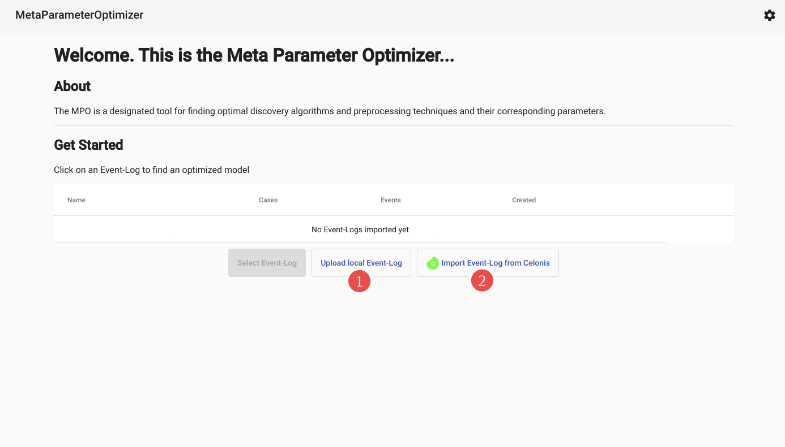

## Importing An Event Log From Your Local File System
After selecting the option to import an event log from your local file system you will be prompted to select a file (1). We currently support the csv and xes file formats for local uploads. 

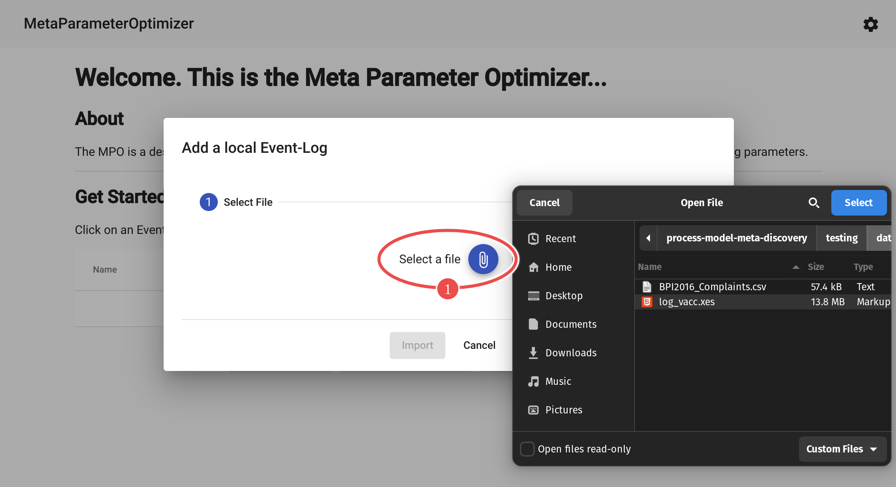

Afterwards you will be asked to specify which column names of your event log correspond to the case identifier, timestamp and activity of your log. We are aware that the xes file format already contains these informations, but still decided to include the selection process for such files as well. The reason for this decision was to allow the user to easily switch the timestamp or activity column when there are multiple potential columns available, without having to upload another xes file with essentially the same event log in it. 

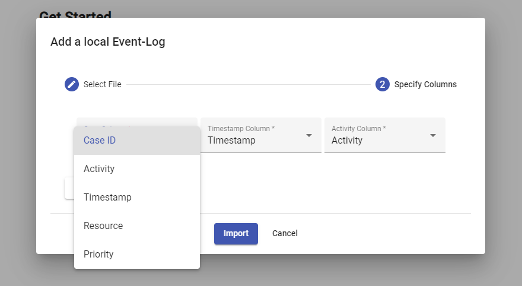

After the selection of the correct column names you can start the import process by hitting the blue import button. Please be patient at this point, since it might take some time to upload and read in an event log, depending on its size.

## Importing An Event Log From Your Celonis Account
If you decide to use the option to import an event log from your Celonis account you will first be prompted to provide some connection details. This will in particular be the url of your cloud (1) and the credentials to authenticate to your user account (2).

You can either specify an application key (*Admin & Settings -> Applications*) with permissions to *Use* and *Manage all Data Pools*, or you can specify an user key (*Edit Profile*) that shares your permissions in the cloud. If you want to use an user key make sure to check the corresponding check box (3) since these are handled differently. For the creation of the access token you may also consider the [Celonis Documentation](https://docs.celonis.com/en/application-keys.html) for further information. In case you do not want to repeatedly insert your Celonis token during every usage of the MPO, there is also the option to store your Celonis credentials (4) as a browser cookie. We want to clarify that we do not take any responsibility regarding the storage safety of this cookie, which is entirely your obligation.

After specifying (1), (2), and (3) you need to fetch (5) the available data models from your Celonis data pool. You can then select (6) the respective data model and import it (7).

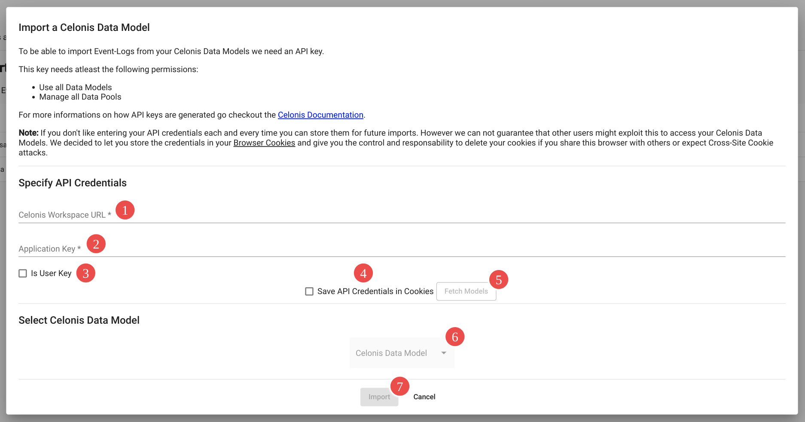

# Event-Log Management

After importing as many event logs as you wish, all of them will be listed in the main view of the MPO. In case you need to refresh your memory on the content of the different logs, you can take a look at the data (3) or consider the number of events and cases which are displayed as well. In case you uploaded an event log by default you can of course remove it (2). To continue with the actual optimization process, click on an event log of interest and press the corresponding button (1) to select it. 

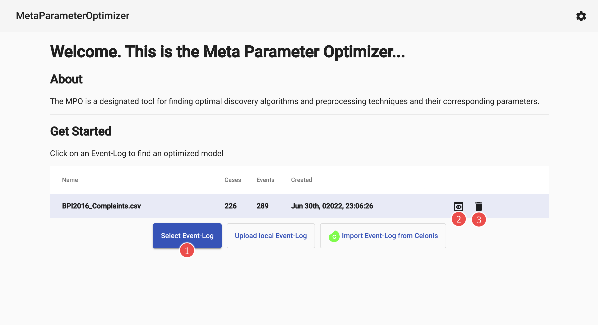

# Search Space Restrictions

There are multiple ways to expand and restrict the search space of the MPO, which are very important to understand correctly. Roughly speaking, the optimizer tries to find the best combination of trace filters, event filters and discovery algorithms for you. Since all of those have their own individual parameters, these will be optimized as well. To decide which combinations and parameters actually are "the best" you can specify quality measures for evaluation. In the following paragraphs we will explain how you can specify all these things, and how they can affect the performance of the optimizer. 

After selecting the event log of interest, you will be redirected to the page for optimization constraints. There you  will be guided through the different steps of the optimizer. 

## Trace And Event Filter Selection

The first thing to specify within the optimization constraints are the trace and event filters, which will potentially be applied to your event log. To edit the configurations of these filters you first have to select the trace filter or event filter in the top bar (1). By selecting one of those the available configurations will appear (2) - (5). You can decide to allow all filters to be used (2), or none (3). Alternatively you can also manually select a subset of the available filters (4). Every filter contains a description in case you are not familiar with the names. With regard to the performance of the optimizer you should definitely consider excluding those filters that you already know not to be useful. In case you have already pre processed the event log before uploading it into the MPO, make sure to deselect all trace and event filters. If you wish to also restrict the parameters of a single filter, you can do so by expanding it (5). A detailed description will follow in the next paragraph.

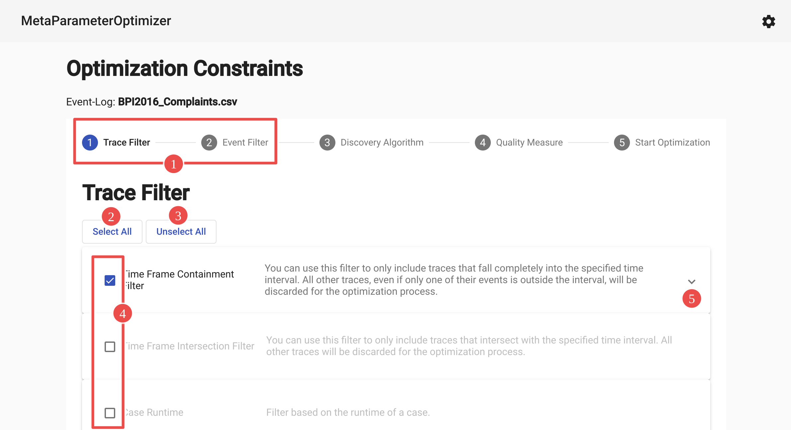

## Parameter Restriction
In case you already have some knowledge about the event log or the filtering technique you can optionally restrict the parameter space that the optimizer will consider. Most filters allow you to specify parameter ranges. The filters' restrictions are preset to values, that are meaningful in the context of the given event log. For example time-based filters are preset to the start and end time of the first and last trace of the event log. There are different types of parameters available. 

### Integral & Numeric Parameter

The numeric parameters include all integer or floating-point numbers. They allow you to specify a lower (2) and upper (3) range bound, as well as an initial value for the optimization (1).

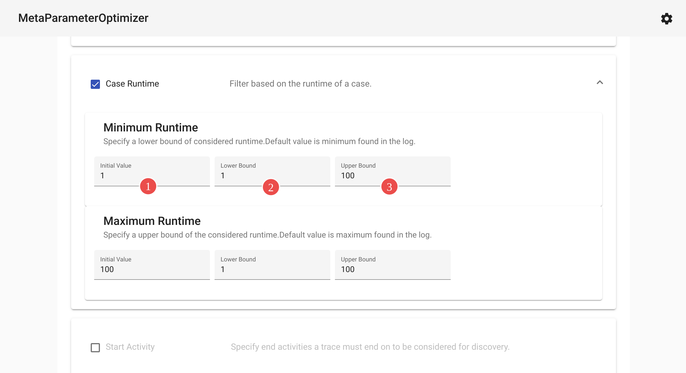

### Timedate Parameter

The time date parameters include all values regarding time bounds. They offer the same restrictions as the numerical parameters for range bounds (1) and initial value (3) but also include a calendar view (2)/(4) for a more convenient editing experience. 

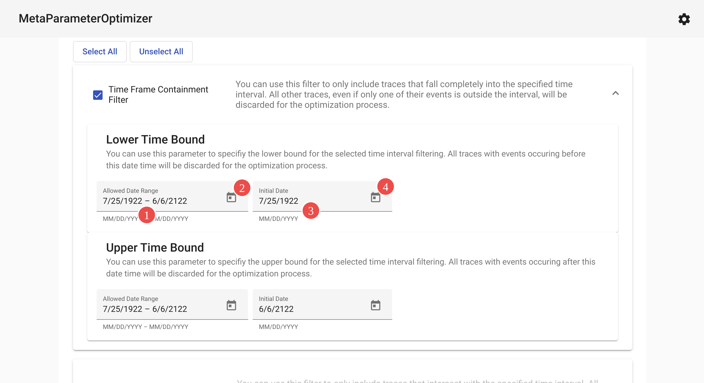

### Selection Set Parameter

The selection set parameters offer the option to select a single value from a given set of options. For such parameters you can edit the set of options, as shown in the upper part of the screenshot below, as well as the initial value, which can be seen in the lower part. 

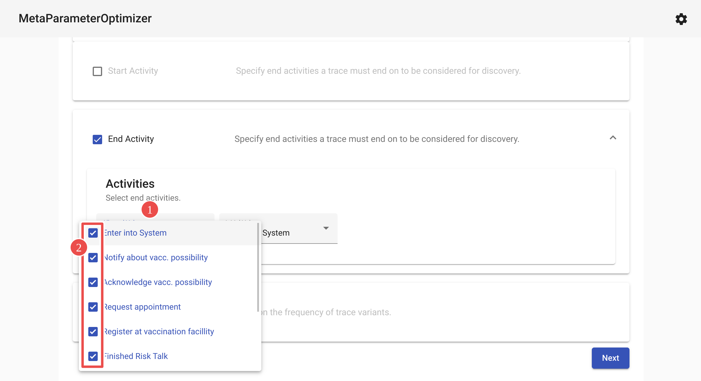
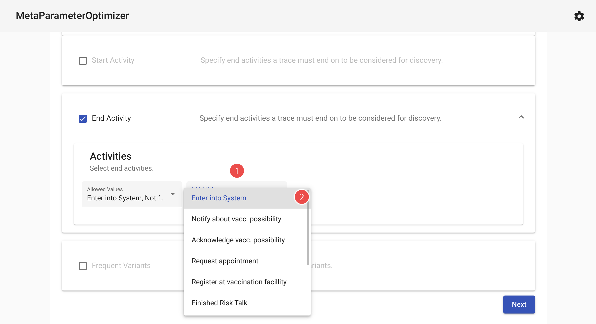

# Discovery Algorithms

After deciding on the restrictions for the trace and event filters you can switch to the view of the discovery algorithms by using the top bar again. You will encounter a view that is analogue to the structure you encountered during the specification of filtering techniques. You again have the option to include all (1), some (3) or none (2) of the supported discovery algorithms. Of course, you can also restrict the parameter space of the algorithms by expanding them (4) and following the same procedure for the different parameters as before. If you have knowledge about the supported discovery algorithms, you should consider deselecting some depending on your needs to enhance the performance.

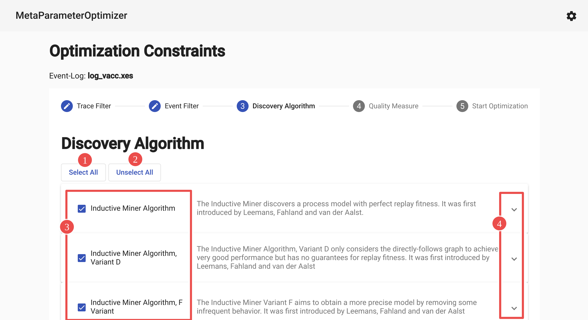

# Quality Measures

For the selection of the quality meaures, used for the evaluation of discovered process models, navigate to the quality measure section in the top bar. You have to option again to select none (2), some (3) or all (1). None of the currently supported quality measures include parameters, so you do not need to expand them (4) as you can not edit anything anyway. Please note that the alignment based quality measures are very time intensive, thus select them carefuly.

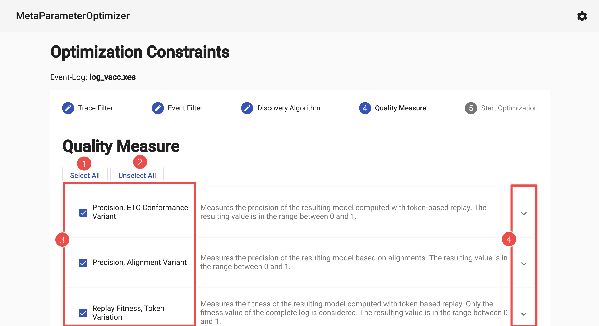

# Optimization

## Starting Optimization

After you have specified all restrictions and selections regarding trace filter, event filter, discovery algorithms and quality measures, you can continue to the optimization section in the top bar. There you can see an slider (1) which will allow you to give the optimizer a time limit. After you have set this according to your needs, you can hit the button (2) to start the optimization. 

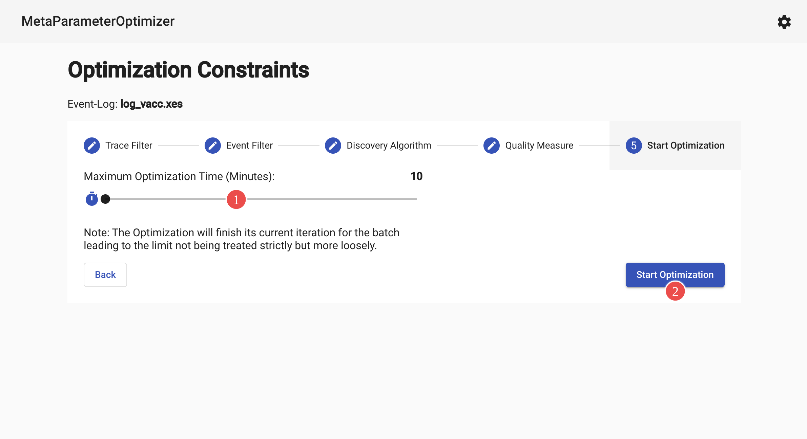

While the optimization is going on you can stop the optimization early (1), get the current best results (2) that were found so far, or enable automatic updates to the current results (3).

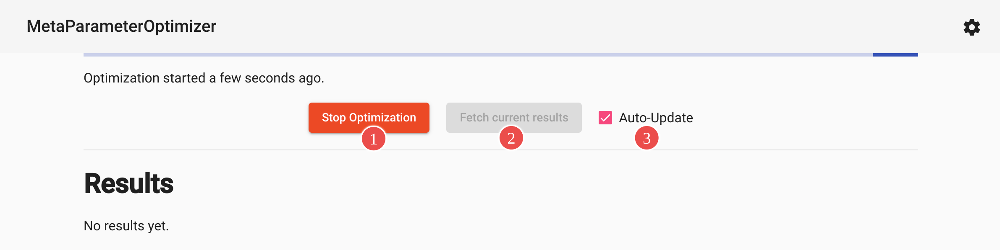

## Export the Process Model

It is possible to export a process model (1) that was discovered with optimized parameters. We currenty offer an export as bpnm file, to quickly import the process model back into Celonis, or as pnml file, to enable further analysis  in ProM for example.

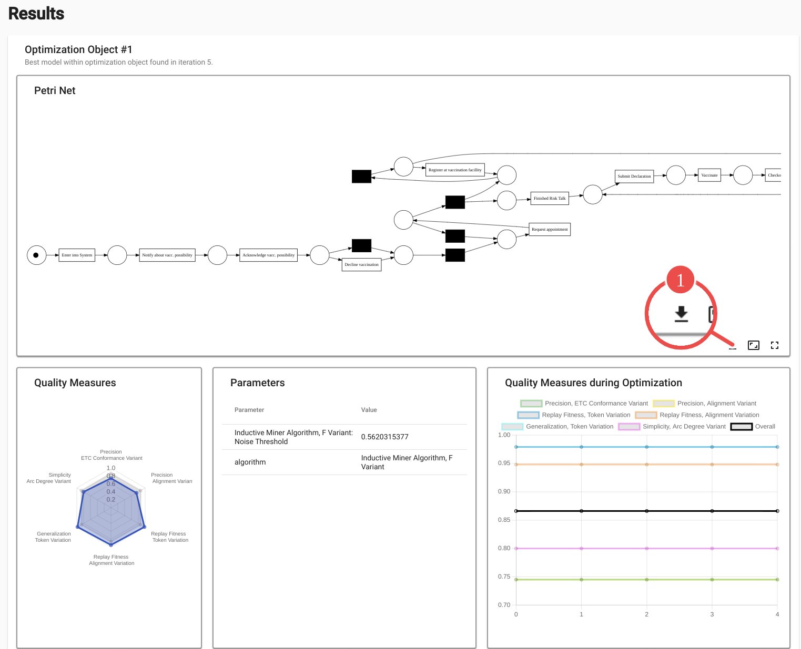

## Result Screen
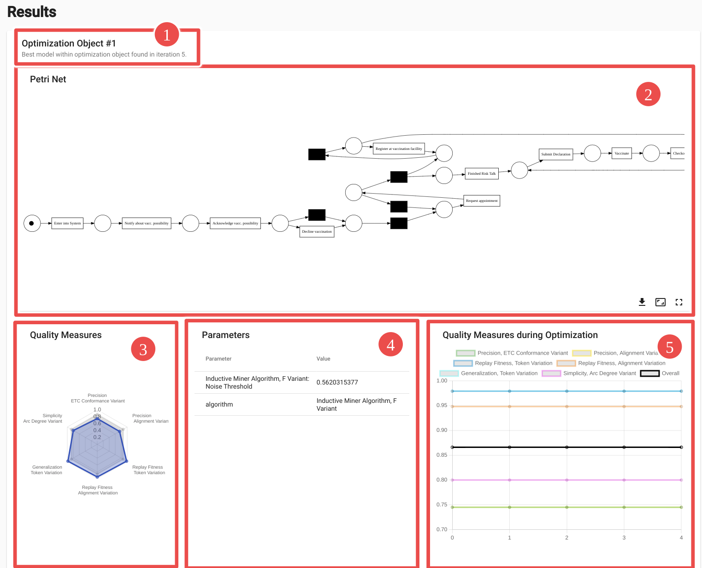
The result screen consists of five elements showing different insights. On the top (1) you can see which rank the optimization object achieved and at which iteration the model which is described in the following was found. This model is the best one according to the overall quality measures within that optimization object. One optimization  object is one potential combination of the enabled trace filters, event filters and discovery algorithms. 

In the middle (2) you can interactively explore the discovered petri net and download the process model. As already explained in the chapter about process model export, we currently support the bpmn and the pnml file format. 

On the bottom left (3) you can see the properties of the resulting net based on your selected quality measures. In case you have selected at least three different quality measures, they are vizualized in a radar chart. 

In the lower middle (4) you can see which combination of trace filters, event filters and discovery algorithm was used to create the represented model. The parameters for each of these steps are included as well. 

The graph on the lower right (5) shows the timeline of the optimization object, regarding the selected quality measures and the overall combined performance (black). The graph shows only the behavior of the individual object not the overall performance of the optimization process.
Empty process models are filtered out by the optimization process which is displayed by a value of 0 for all quality measures in the graph.

